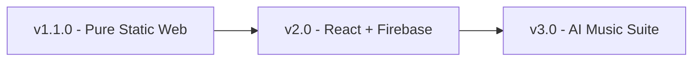

# <p align="center">🎵 MusicBook v1.1.0 🎶</p>

<p align="center">
  <strong>An All-in-One Browser-Based Music Toolkit Platform</strong><br>
  <em>Designed for Musicians, Students & Music Enthusiasts.</em>
</p>

<p align="center">
  <a href="https://github.com/m-PdeveloperPro"></a>
  
  
  
</p>

<p align="center">
  <a href="#-about-the-project">About</a> •
  <a href="#-core-tools--features">Tools</a> •
  <a href="#-tech-stack">Tech Stack</a> •
  <a href="#-project-structure">Structure</a> •
  <a href="#-design-system">Design System</a> •
  <a href="#-future-roadmap">Roadmap</a>
</p>

---

## 🌟 About the Project

**MusicBook** යනු සංගීත ප්‍රගුණ කරන, අධ්‍යයනය කරන සහ සංගීතයට ලැදි ඕනෑම අයෙකුට අවශ්‍ය වන සියලුම ප්‍රධාන ඩිජිටල් මෙවලම් එකම සරල, නවීන වෙබ් අතුරුමුහුණතකින් ලබාදෙන Complete Online Toolkit එකකි. 

> 🎯 **Core Purpose:** **Learn** • **Practice** • **Create** • **Perform**

✨ **Highlights:**
* 🚫 **Zero Audio Files:** සියලුම ශබ්ද (Metronome clicks, Tanpura drone, Tabla hits) Web Audio API මගින් real-time synthesize කරනු ලබයි.
* ⚡ **Ultra Fast & Lightweight:** Backend හෝ external frameworks නොමැති බැවින් ඉතා වේගවත්ව ක්‍රියාත්මක වේ.
* 📱 **Fully Responsive:** මොබයිල් ඇතුළු සියලුම තිර සඳහා මනාව ගැලපෙන Responsive Design එකක් ඇත.

---

## 🛠️ Core Tools & Features

|<br>Tool<br>| Description & Capabilities |
| :--- | :--- |
| 🎻 **Instrument Tuner** | Microphone මගින් real-time pitch detection සිදු කරයි. Autocorrelation algorithm භාවිතයෙන් Note name, frequency සහ tuning accuracy needle එක පෙන්වයි. |
| 🎵 **Virtual Tanpura** | Sa-Pa-Sa-Sa සහ Sa-Ma-Sa-Sa drone options සහිතව Selectable keys 12ක් පුරා වාදනය කළ හැක. |
| 🥁 **Metronome** | 40-240 BPM දක්වා සකස් කළ හැකි, Accented first beat (Sam) සහ Beats per bar තේරීමේ පහසුකම් සහිතයි. |
| 🪘 **Electronic Tabla** | Teentaal, Dadra, Jhaptal සහ Rupak ताल සපයන අතර visual beat grid එකක් මගින් Sam Highlight කර පෙන්වයි. |
| 🎸 **Chord Dictionary** | Search & Filter පහසුකම් සහිත Chord එකතුවක් සහ සජීවී SVG Fretboard diagrams. |
| ⏱️ **BPM Finder** | Spacebar හෝ Mouse tap කිරීමෙන් Rolling average සලකා බලමින් ඕනෑම සින්දුවක BPM එක සොයාගත හැක. |
| 📖 **Tuning Reference** | Guitar, Ukulele, Violin, Viola, Cello, Bass, සහ Mandolin සඳහා වන Standard Tunings එකතුවක්. |

---

## 💻 Tech Stack

<div align="center">

| Category | Technology Used |
| :--- | :--- |
| **Languages** | HTML5 • CSS3 • JavaScript (ES6+) |
| **Web APIs** | Web Audio API • MediaDevices API |
| **Hosting** | GitHub Pages (Static Hosting) |
| **Build Tools** | None required (Pure Native Code) |

</div>

---

## 📁 Project Structure

```text
MusicBook/
├── 📄 index.html
├── 📂 css/
│   ├── 🎨 style.css
│   └── 🎬 animation.css
├── 📂 js/
│   ├── ⚙️ main.js
│   ├── 🥁 metronome.js
│   ├── 🎻 tuner.js
│   ├── 🎵 tanpura.js
│   ├── 🪘 tabla.js
│   ├── 🎸 chords.js
│   └── ⏱️ bpm.js
├── 📂 pages/
│   ├── 🧰 tools.html
│   ├── ℹ️ about.html
│   └── ✉️ contact.html
├── 📂 tools/
│   ├── 🥁 metronome.html
│   ├── 🎻 tuner.html
│   ├── 🎵 tanpura.html
│   ├── 🪘 tabla.html
│   ├── 🎸 chords.html
│   ├── ⏱️ bpm.html
│   └── 📖 instruments.html
├── 📂 data/
│   ├── 📊 chords.json
│   └── 🎼 ragas.json
└── 📂 assets/
    ├── 🖼️ images/
    └── 🎨 icons/
```

---

## 🎨 Design System

Dark Music Studio තේමාවට අනුව නිර්මාණය කර ඇත:

```
[Background] #0B1020  ████████████████
[Panel]      #111827  ████████████████
[Primary]    #7C3AED  ████████████████
[Secondary]  #06B6D4  ████████████████
[Gold]       #F59E0B  ████████████████
```

* **Typography:** `Poppins` (Headings) | `Inter` (Body)
* **Animations:** Subtle audio-reactive styling with `prefers-reduced-motion` compliance.

---

## 🚀 Future Roadmap



- [x] **v1.1.0 - Core Launch:** Complete toolkit with fully functional synth-audio tools.
- [ ] **v2.0 - User Experience:** React version with Firebase Authentication & saved user profiles.
- [ ] **v3.0 - AI Tools:** AI Vocal Separation, Automatic Raga Detection & Music Notation Generation.

---

## 📬 Contact & Support

<p align="center">
  Designed & Developed with ❤️ by <strong>m-PdeveloperPro</strong><br>
  📧 Got feedback? Reach out at: <a href="mailto:madurangadahanake@gmail.com">madurangadahanake@gmail.com</a>
</p>
